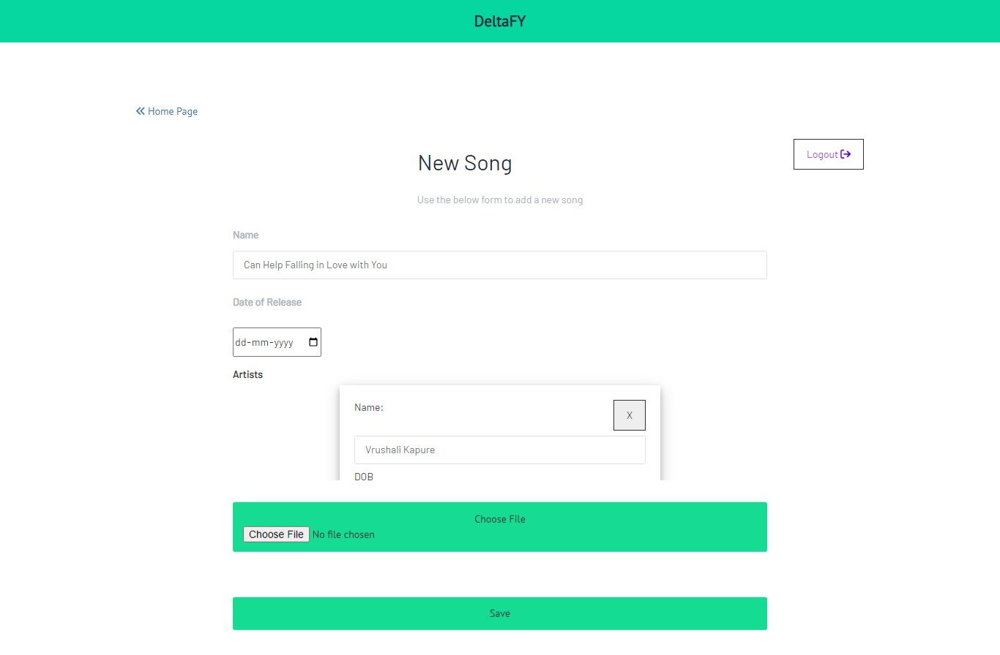

# DeltaFY
In this project, I have created a node application that provides users a song management application and also shows the top 10 songs and artists in the system.

## To Run this project Clone it and follow the below steps

* To install all the dependencies of the project.

```
npm install
```

* To run the application.

```
npm start
```

* Open the following URL in the browser

```
http://localhost:3000/login
```

* Note:- This application runs on `3000` port you can change the port number by updating the `PORT` property in the `config.env` file, also the project uses my own MongoDB datastore URL which also you can replace by updating the `MONGO_URI` property in the `config.env` file.

Wohh...! now we have properly installed and run the application,


## Technical Specifications of the application

* Nodejs (Express)
* EJS (Embedded JavaScript templates)
* MongoDB 

## Application features

* User can register himself.
* User can log in with the registered creds.
* The home will list the top 10 songs sorted by rating which is also displayed in the form of stars along the side of each song and the top 10 artists whose rating is based on their song's average rating.
* User can provide rating's to multiple songs on home page.
* User can provide a rating to a song by clicking on the rating stars and the page updates the list of top 10 songs automatically and also update the top 10 artists.
* User can add new songs and can also add new artists while adding a new song, which uses the `ajax` feature to create a new artist `asynchronously`.

## Screenshot of the application 

* Login screen 


* Registration screen 


* Home screen 


* Add new song screen 



